# ObjectSegmentCNN

A Comparison Between Human Visual Perception Under Object Segmentation and
Recognition with Current Deep Neural Networks.

## *Abstract* 
- The idea behind this work is comparing deep convolutional neural networks and human visual perception system in classifying different objects. Moreover, in proposed research, diagnostic regions for human visual system and famous deep convolutional neural networks have been extracted; these regions are the most salient areas of images which have caused for accurate classification. They persumably have more meanings for each systems. 
- We computed the diagnostic features of each image in each category with 5 convolutional networks ([VGG16](https://arxiv.org/abs/1409.1556), [ResNet50](https://arxiv.org/abs/1512.03385), [EfficientNetb0](https://arxiv.org/abs/1905.11946),  [AlexNet](https://proceedings.neurips.cc/paper/2012/file/c399862d3b9d6b76c8436e924a68c45b-Paper.pdf) and [DenseNet-169](https://arxiv.org/pdf/1608.06993.pdf)), 5 saliency models ([GBVS](https://proceedings.neurips.cc/paper/2006/file/4db0f8b0fc895da263fd77fc8aecabe4-Paper.pdf), [Itti](https://www.researchgate.net/publication/3192913_A_Model_of_Saliency-based_Visual_Attention_for_Rapid_Scene_Analysis), [Signature](https://cvhci.anthropomatik.kit.edu/~bschauer/pdf/schauerte2012predicting.pdf), Simpsal and Spectral) and finally with Human visual perception system.

| VGG16           | 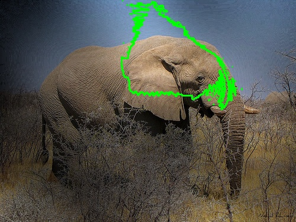          | 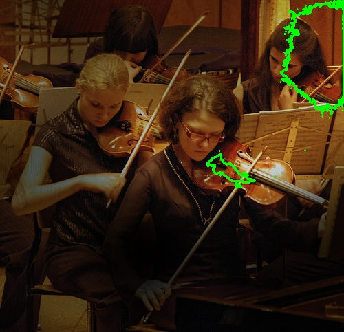  	      | 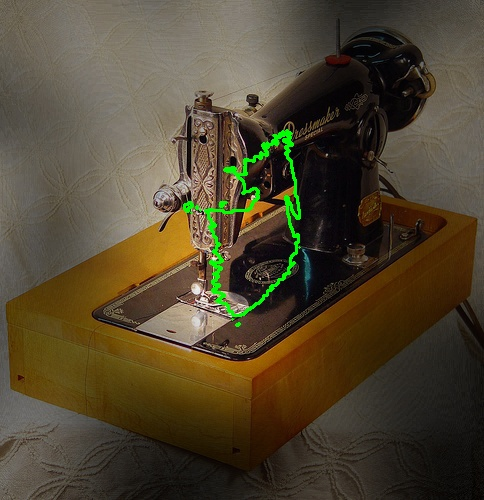  	    | 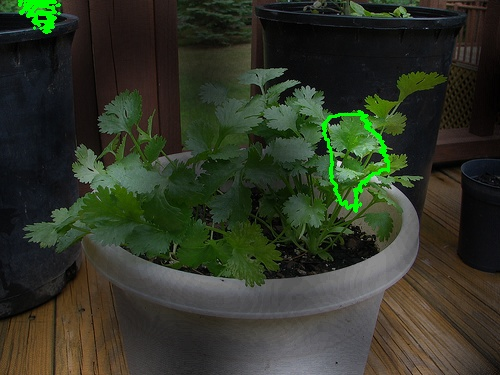  	      | 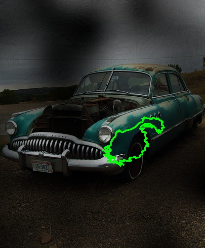  	      |
|:---------------:|:-----------------------------------:|:-----------------------------------:|:-----------------------------------:|:-----------------------------------:|:-------------------------------------:|
| ResNet-50 	  |    	| 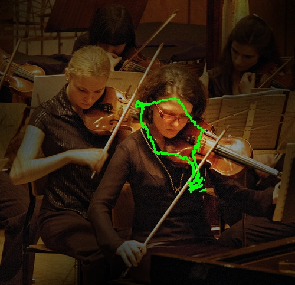  	  | 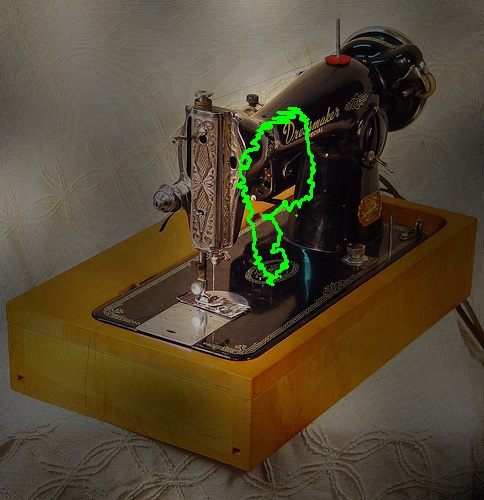  	    | 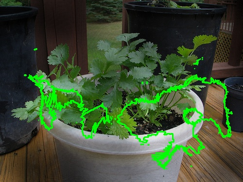  	  | 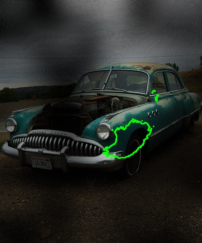    	  |
| DenseNet-169    | 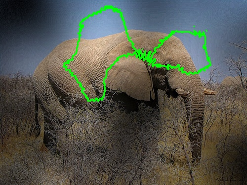    | 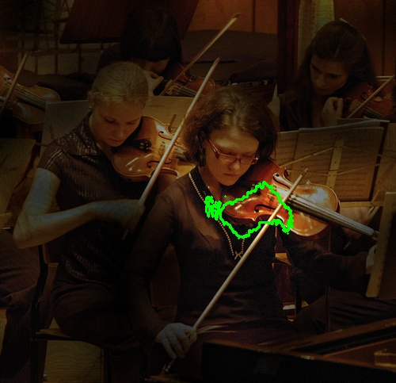    | 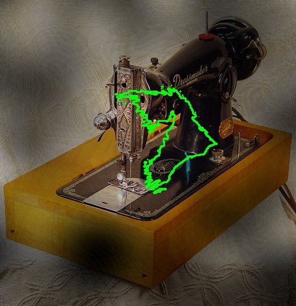    | 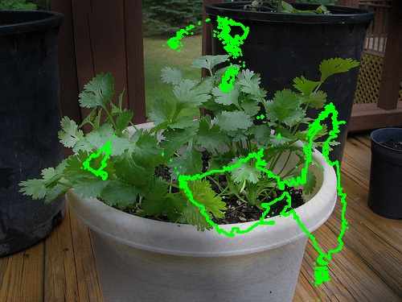    | 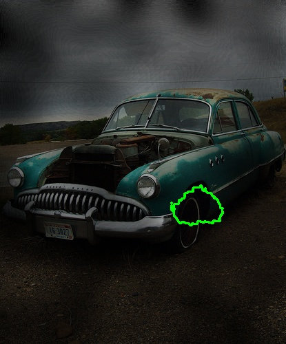      |
| AlexNet  	      | 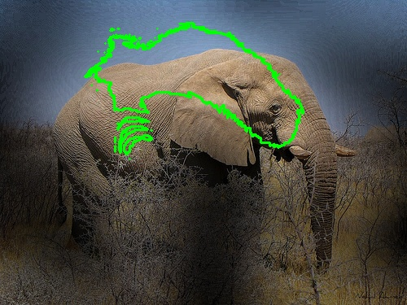        | 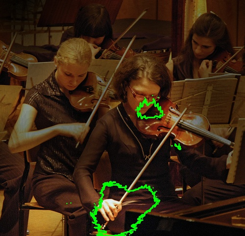  	  | 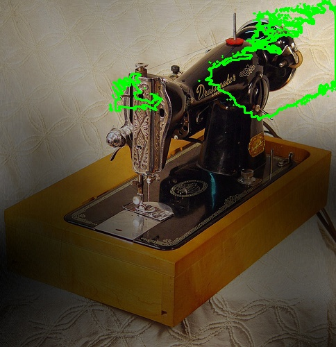  	    | 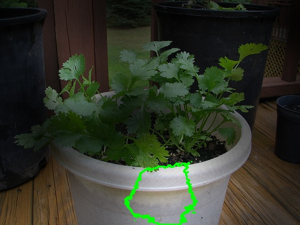  	  | 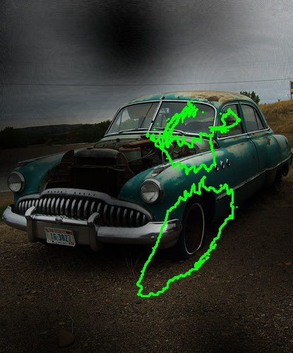  	      |
| EfficientNet-b0 | 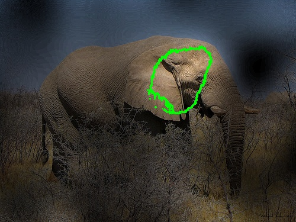 | 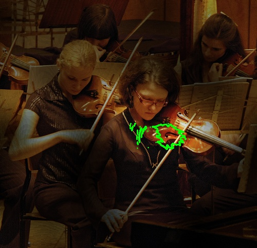 | 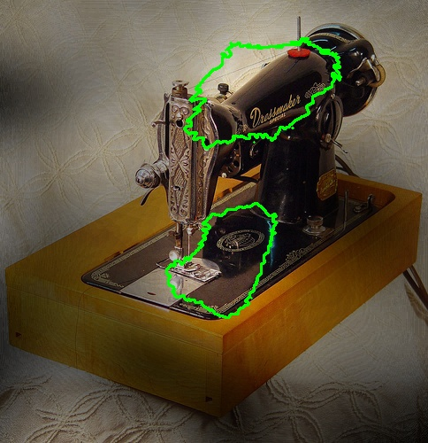 | 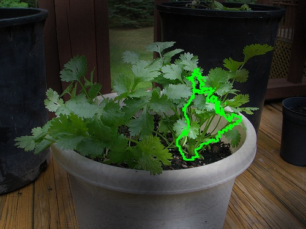 | 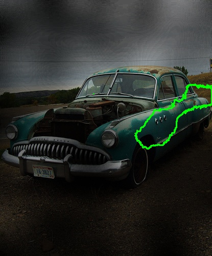   |

You can either follow our osf project directory.
and youtube presentation and article summaries as usual.
code explanation for permutation testsin oython will be added.
*statistichal tests will be added.
