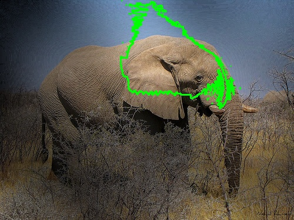
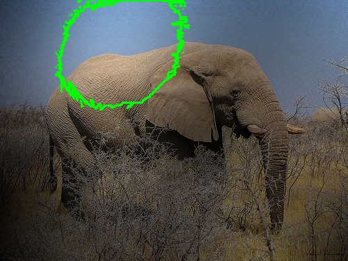
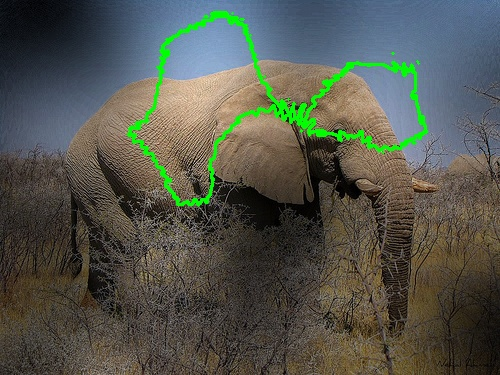
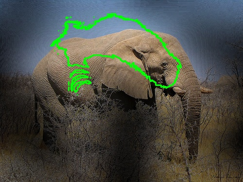
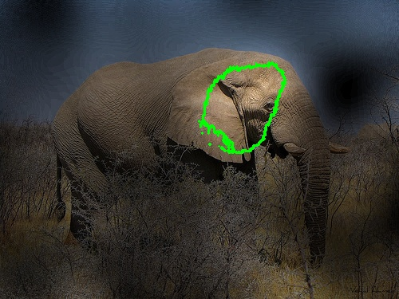

# ObjectSegmentCNN

A Comparison Between Human Visual Perception Under Object Segmentation and
Recognition with Current Deep Neural Networks.

The main approach is inherited from permutation tests and is also many different statistical test have been given which is mentioned below.
In proposed research, diagnostic regions for human visual perception system and famous deep convolutional neural networks have been compared.
We computed the diagnostic features of each image in each category with different Convolutional Networks, Different Statistichal tests and finally with Human visual perception system.

VGG16                      |  ResNet50                 | DenseNet169               |  AlexNet                  |  EfficientNetb0           |
:-------------------------:|:-------------------------:|:-------------------------:|:-------------------------:|:-------------------------:|
        |        |        |        |        |

VGG16             |  ResNet50         | DenseNet 169 | AlexNet | EfficientNetb0 |
:-------------------------:|:-------------------------:|:-------------------------:|:-------------------------:|:-------------------------:|
  |   |  |  |  |

You can either follow our sfc project directory.
and youtube presentation and article summaries as usual.
