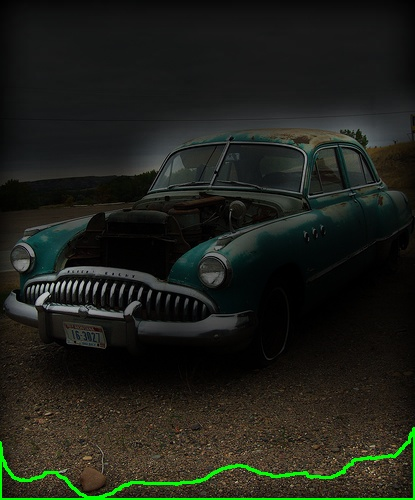

<h1 align="center">Object Segment CNN</h1>

<h6 align="center">A Comparison Between Human Visual Perception Under Object Segmentation and Recognition with Current Deep Neural Networks.</h6>

<h3 align="center">Abstract</h1>

> - The idea behind this work is comparing the attention of deep convolutional neural networks and human visual perception system in classifying objects. In proposed research, diagnostic regions for human visual system and famous deep convolutional neural networks have been calculated; these regions are the most salient areas of each image which have led to accurate classification. They persumably have more meanings (than other regions) for each systems respectively. 

> - We computed the diagnostic features of each image in each category with 5 convolutional networks ([VGG16](https://arxiv.org/abs/1409.1556), [ResNet50](https://arxiv.org/abs/1512.03385), [EfficientNetb0](https://arxiv.org/abs/1905.11946),  [AlexNet](https://proceedings.neurips.cc/paper/2012/file/c399862d3b9d6b76c8436e924a68c45b-Paper.pdf) and [DenseNet-169](https://arxiv.org/pdf/1608.06993.pdf)), 5 saliency models ([GBVS](https://proceedings.neurips.cc/paper/2006/file/4db0f8b0fc895da263fd77fc8aecabe4-Paper.pdf), [Itti](https://www.researchgate.net/publication/3192913_A_Model_of_Saliency-based_Visual_Attention_for_Rapid_Scene_Analysis), [Signature](https://cvhci.anthropomatik.kit.edu/~bschauer/pdf/schauerte2012predicting.pdf), [Simpsal](https://arxiv.org/pdf/2010.12913.pdf) and [Spectral](https://www.researchgate.net/publication/221364530_Saliency_Detection_A_Spectral_Residual_Approach)) and finally with human visual perception system under a designed behavioural task.

> - Have a look at following visual results for each section.

<h3 align="center">Results</h1>

 - **On Deep CNNs** 

| VGG16           |           |   	      |   	    |   	      |   	      |
|:---------------:|:-----------------------------------:|:-----------------------------------:|:-----------------------------------:|:-----------------------------------:|:-------------------------------------:|
| ResNet-50 	  |    	|   	  |   	    |   	  |     	  |
| DenseNet-169    |     |     |     |     |       |
| AlexNet  	      |         |   	  |   	    |   	  |   	      |
| EfficientNet-b0 |  |  |  |  |    |

 - **On Saliency Models** (will be added)
 

| GBVS           |           |   	      |   	    |   	      |   	      |
|:---------------:|:-----------------------------------:|:-----------------------------------:|:-----------------------------------:|:-----------------------------------:|:-------------------------------------:|
| Itti-Koch 	  |    	|   	  |   	    |   	  |     	  |
| Signature    |     |     |     |     |       |
| Simpsal  	      |         |   	  |   	    |   	  |   	      |
| Spectral |  |  |  |  |    |

> - OSF project.
> - youtube presentation 
> - Abstract articles
> - Code explanation for permutation tests
> - Behavioural task

Preview


puts 'Expanded message'


## Feedback

If you had any feedback or question, please reach out to me at mh.nikimaleki@gmail.com
## 🔗 Links

